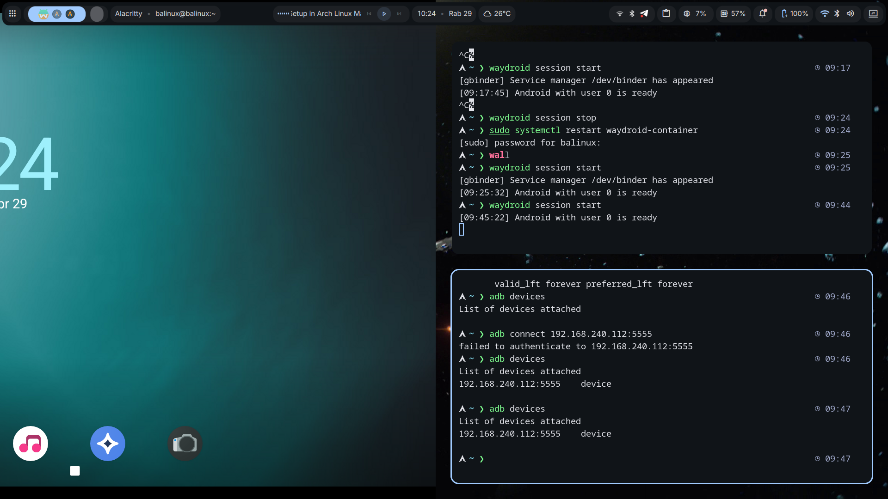

Menjalankan aplikasi Android di Linux dulu bukan hal yang mudah.

- Virtual Machine → berat
    
- Emulator → lambat
    
- Tool lama seperti Anbox → kurang stabil
    

Sampai akhirnya saya menemukan **Waydroid**.

> Waydroid adalah sistem berbasis container yang memungkinkan menjalankan Android langsung di Linux tanpa emulasi. ([Wikipedia](https://en.wikipedia.org/wiki/Waydroid?utm_source=chatgpt.com "Waydroid"))

Tapi… ada satu masalah besar.

Saat saya menjalankannya di **CachyOS (turunan Arch Linux)**:

- Tidak ada internet ❌
    
- IP address `UNKNOWN` ❌
    
- ADB tidak bisa connect ❌
    

Artikel ini akan membahas:

- Cara install Waydroid
    
- Cara kerjanya
    
- Dan yang paling penting: **cara fix error network (real case)**
    

---

# 🧠 Apa itu Waydroid (dan Kenapa Cepat)

Berbeda dengan emulator, Waydroid:

- Menjalankan Android di dalam **container (LXC)**
    
- Menggunakan **kernel Linux yang sama**
    
- Tidak ada emulasi CPU
    

> Waydroid menggunakan Linux namespaces untuk menjalankan sistem Android penuh dalam container dan tetap bisa mengakses hardware secara langsung. ([Waydroid](https://docs.waydro.id/?utm_source=chatgpt.com "Waydroid"))

👉 Artinya:

> Android berjalan “native” di Linux, bukan disimulasikan

---

# ⚙️ Step 1 — Install Waydroid (Arch / CachyOS)

```bash
yay -S waydroid
sudo systemctl enable --now waydroid-container
```

Lalu inisialisasi:

```bash
sudo waydroid init
```

Proses ini akan:

- Download image Android (LineageOS)
    
- Setup container Android  
    ([TheDocs](https://thedocs.io/waydroid/core_concepts/architecture/?utm_source=chatgpt.com "Waydroid - Core Concepts - Architecture"))
    

---

# ▶️ Step 2 — Menjalankan Waydroid

```bash
waydroid session start
waydroid show-full-ui
```

Jika berhasil, Android akan muncul di layar.

---

# ❌ Masalah yang Saya Alami

Setelah install, Waydroid memang jalan… tapi:

```bash
waydroid status
```

Output:

```
IP address: UNKNOWN
```

Dan di dalam container:

```bash
waydroid shell ip a
```

Hasil:

- ❌ Tidak ada IP (192.x.x.x)
    
- ❌ Tidak ada internet
    
- ❌ ADB gagal connect
    

---

# 🧠 Root Cause (Ini yang Paling Penting)

Setelah debugging cukup lama, ternyata masalahnya bukan Waydroid.

Tapi kombinasi ini:

---

## 🔴 1. Firewall (UFW)

```bash
-P FORWARD DROP
```

👉 Ini artinya semua traffic container diblok

---

## 🔴 2. VPN (Tailscale)

Tailscale:

- Mengubah routing jaringan
    
- Mengganggu bridge network Waydroid
    

---

## 🔴 3. DHCP Gagal

Waydroid butuh:

- UDP 67 → DHCP
    
- UDP 53 → DNS
    

Kalau diblok:  
👉 Android tidak akan dapat IP

---

# 🔥 SOLUSI (REAL FIX)

Ini step yang benar-benar menyelesaikan masalah saya.

---

## ✅ 1. Fix Tailscale

```bash
tailscale up --accept-dns=false --accept-routes=false
```

👉 Tujuannya:

- Supaya traffic lokal tidak lewat VPN
    

---

## ✅ 2. Fix Firewall (UFW)

```bash
sudo ufw default allow FORWARD
sudo ufw allow 67/udp
sudo ufw allow 53/udp
sudo ufw reload
```

👉 Ini step paling penting

---

## 🔁 3. Restart Waydroid

```bash
waydroid session stop
sudo systemctl restart waydroid-container
waydroid session start
```

---

# ✅ Hasil Akhir

Setelah semua diperbaiki:

```bash
waydroid shell ip a
```

Output:

```
inet 192.168.240.xxx
```

🎉 Berhasil!

Artinya:

- DHCP jalan
    
- Network hidup
    
- Android normal
    

---

# 🔌 Bonus: Menghubungkan ADB

Aktifkan dulu di Android:

- Developer Options
    
- USB Debugging
    

Lalu:

```bash
adb connect 192.168.240.xxx:5555
adb devices
```

---

# 🧠 Insight Penting (Pelajaran dari Kasus Ini)

Dari pengalaman ini, saya belajar:

> Sebagian besar masalah Waydroid bukan dari Waydroid itu sendiri.

Tapi dari:

- Firewall
    
- VPN
    
- Routing Linux
    

---

# 🧩 Cara Kerja Network Waydroid

```text
Host Linux
 ├─ wlan0 (internet)
 ├─ waydroid0 (bridge)
 │
 └── Android Container
       └─ 192.168.240.x
```

Jika salah satu bagian ini rusak:  
👉 Android tidak akan punya internet

---

# ⚠️ Tips untuk Pengguna Arch / CachyOS

Kalau kamu pakai distro seperti CachyOS:

- Selalu cek:
    
    - `FORWARD` policy
        
    - UFW rules
        
    - VPN (Tailscale)
        
- Jangan campur:
    
    - iptables
        
    - nftables
        
    - UFW (pilih salah satu)
        

---

# 📌 Kesimpulan

Waydroid adalah solusi terbaik untuk menjalankan Android di Linux:

- Ringan
    
- Cepat
    
- Tidak pakai emulator
    

Tapi kalau kamu menemui error seperti:

```
IP address: UNKNOWN
```

👉 Jangan panik.

Cek:

- Firewall (FORWARD)
    
- VPN (Tailscale)
    
- DHCP (port 67 & 53)
    

Dan Waydroid kamu akan kembali normal.

---

# 🚀 Penutup

Sekarang Waydroid saya sudah:

- Bisa internet
    
- Bisa install app
    
- Bisa ADB
    

Dan bisa jadi **Android emulator super ringan untuk development**.

