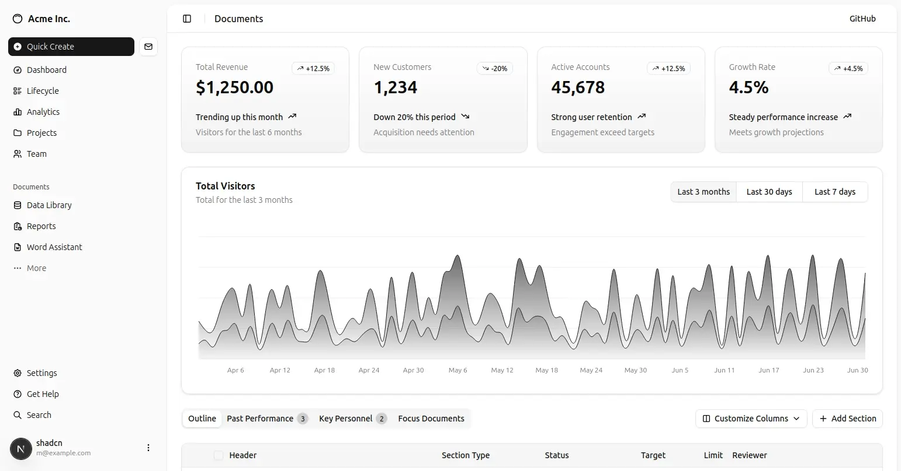
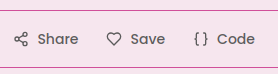
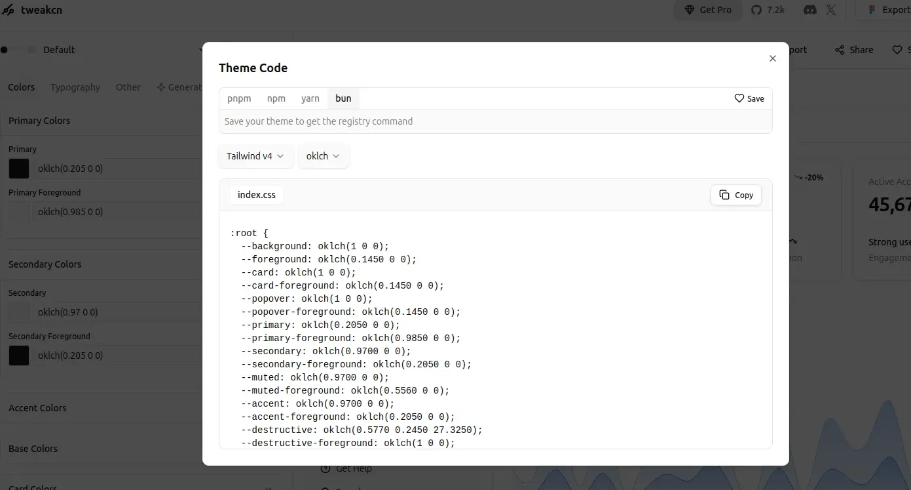
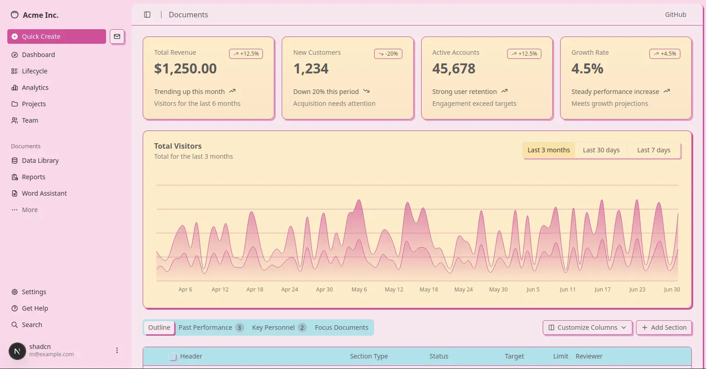

Halo, kembali lagi di blogku. Kali ini aku mau share hal sederhana saja yaitu bagaimana setup dashboard dari block shadcn ke dalam project nextjs, dan akan di custom theme menggunakan tweakcn

# install nextjs

untuk membangun aplikasi pada konten kali ini saya akan menggunakan Bun, yaitu sebuah runtime javascript yang sangat keren dan cepat.

berikut perntahnya

```
bun create next-app@latest content-yt
```

selanjutnya ikuti perintah ini

```
What is your project named? content-yt
Would you like to use TypeScript? No / Yes
Which linter would you like to use? ESLint / Biome / None
Would you like to use Tailwind CSS? No / Yes
Would you like your code inside a `src/` directory? No / Yes
Would you like to use App Router? (recommended) No / Yes
Would you like to use Turbopack? (recommended) No / Yes
Would you like to customize the import alias (`@/*` by default)? No / Yes
What import alias would you like configured? @/*
```

# Setup Shadcn

selanjutnya kita perlu menjalankan perintah dibawah ini dengan tujuan untuk setup shadcn UI ke dalam project nextjs

```
bunx --bun shadcn@latest init
```

jika sudah terintall selanjutnya yaitu percobaan untuk mengintall sebuah component button dari shadcn

```
bunx --bun shadcn@latest add button
```

selanjutnya coba implementasi component button ke dalam project next.js yang dimiliki

```jsx
import { Button } from "@/components/ui/button"

export default function Home() {
  return (
    <div>
      <Button>Click me</Button>
    </div>
  )
}
```

# Setup dashboard shadcn

tahap selanjutnya yaitu install block dashboard. Pertama kunjungi block shadcn pada halaman [https://ui.shadcn.com/blocks](https://ui.shadcn.com/blocks). Pada halaman tersebut terdapat banyak block termasuk block dashbaord yang akan kita coba

```jsx
bunx --bun shadcn@latest add dashboard-01
```

setelah selesai install dashboard maka sleanjutnya secara otomatin perintah tersebut akan membuat file page.tsx di dalam folder dashboard, dan kalian bisa akses dengan llink seperti ini [http://localhost:3000/dashboard](http://localhost:3000/dashboard), dan hasilnya akan terlihat seperti gambar di bawah ini




# Custom theme with tweakcn

selanjutnya ke tahap terakhir yaitu menginstall tweakcn untuk custom theme dari shadcn.

untuk memulai pertama akses halaman website tweakcn [https://tweakcn.com/editor/theme](https://tweakcn.com/editor/theme).

Pada halaman itu akan menampilkan beberapa theme, dan pada kali ini saya akan mencoba theme Bubblegum, atau kamu bisa memilih theme yang kamu mau.

setelah memilih theme yang akan kamu gunakan, selanjutnya arahkan cursor kebagian kanan atas sampai menemukan tombol code




selanjutnya copy semua css yang ada didalamnya. style ini kita akan gunakan untuk mengganti style pada file global.css nextjs



setelah copy, buka file global.css pada project nextjsmu, dan hapus semua code di dalam baris @theme inline, _:root,_ .dark. Ganti dengan css yang di copy tadi, dan hasilnya akan seperti dibawah ini



Semoga bermanfaat