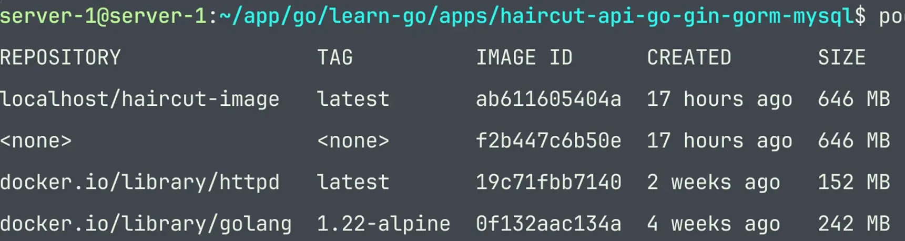
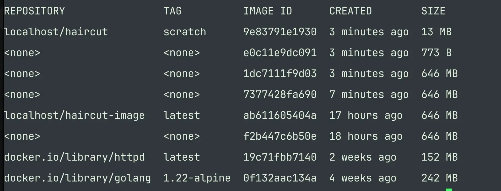

# Permasalahan

pernah gak sih kalian berfikir kenapa kok podman image atau docker image bisa sebesar itu, bisa gak ukurannya dikecilkan agar tidak memakan ruang penyimpanan yang sangat besar.

awalnya saya juga bingung, tapi setelah beberapa saat berselancar di internet, akhirnya nemu juga nih cara untuk mengurangi ukuran image

oke hari ini saya akan mencoba compress image podman yang awalnya 646 MB menjadi lebih kecil bisa sekita 13 MB

jika kalian tidak percaya bisa menlihat code screenshoot ini



jika kamu perhatikan pada image pertama itu ukurannya bisa mencapai 646 MB, gila itu besar banget sih, config Dokcerfilenya kurang lebih seperti ini

```docker
FROM docker.io/library/golang:1.22-alpine
WORKDIR /app
COPY go.mod go.sum ./
RUN go mod download
COPY . .
RUN go build -o /haircut-app
EXPOSE 8000
CMD [ "/haircut-app" ]
```

lalu jika bagaimana solusi yang bisa diberikan dari permasalah yang diatas

# Solusi

solusi yang saya berikan untuk mengatasi permasalahan tersebut adalah dengan cara menggunakan multi stage dan menggunakan image sractch untuk menjalankan aplikasi go.

kebetulan contoh disini saya akan menggunakan conth aplikasi yang dibuat menggunakan bahasa golang dengan framewrork web gin, gorm dan database menggunakan mysql

jadi nantinya akan menjalankan sebuah service api

oke agar tidak berlama-lama lanjut ke tahap berikutnya

## Dockerfile

untuk contoh dockerfile multi stage menggunakan image dari scratch bisa kamu lihat disini

```docker
FROM docker.io/library/golang:1.22-alpine AS build
WORKDIR /app
COPY go.mod go.sum ./
RUN go mod download
COPY . .
RUN CGO_ENABLED=0 go build -o haircut-app .

# add stage for scratch image
FROM scratch
COPY --from=build /app/haircut-app /haircut-app
EXPOSE 8000
CMD [ "/haircut-app" ]
```

jika dilihat stage awal saya gunakan image golang untuk sekedar build aplikasi golang yang saya buat, selanjutnya di stage 2 saya menggunakan image scratch untuk menjalankan aplikasi golang

## Membersihkan images

sebelum menjalankan file disini saya melakukan pembersihan image podman yang tidak digunakan agar lebih bersih.

cara membersihkan image podman dengan menggunakan perintah terminal podman seperti ini

```docker
podman system prune -a
```

## Build image

setelah melakukan clear selanjutnya build image aplikasi golang ini dengan melakukan eksekusi perintah di terminal podman

```docker
podman build -t haircut:scratch . 
```

jika diperhatikan perintah diatas saya eksekusi Dockerfile dan membuat image dengan nama haircut dengan tag scratch

## Cek images

selanjutnya jika proses build image selesai, maka selanjutnya jalankan perintah untuk melihat hasil image yang dibuild dengan menggunakan perintah di bawah ini

```docker
podman images
```

jika kamu perhatikan gambar di bawah ini, pada image yang paling baru(paling atas) terlihat ukuran file hanya sebesar 13 MB, yey berhasil keren kan bisa sekecil itu



## Running container

tahap selanjutnya menjalankan image dengan menggunakan perinah seperti ini awah ini

```docker
podman run -d -p 9999:8000 -it --name haircut-v1 haircut:scratch
```

aplikasi saya jalankan pada container denga. port akses 9999 nama haircut-v1 menggunakan image haircut:scratch yang sudah kita buat sebelumnya

## Tes aplikasi

dibawah ini saya menampilkan log akses dari container, untuk menampilkan log kamu bisa menggunakan perintah

```docker
podman logs -f haircut-v1
```

ada hal menarik yang saya temui setelah menggunakan image scratch, aplikasi golang yang saya jalankan ternyata bisa diakses lebih cepat dibandingkan sebelumnya. Kamu bisa lihat rata-rata masih berkisar 700 sampai 900 microsecond. ini menurutku cepet banget.

dan yang terakhir hasil tampilah JSON dari respon API yang saya buat, menunjukkan bahwa aplikasi bisa berjalan dengan baik.

## kesimpulan

- Podman atau Docker image dapat dikompresi dari 646 MB menjadi 13 MB menggunakan teknik multi stage dan image scratch
- Langkah pertama melibatkan penggunaan image golang untuk build aplikasi, kemudian menyalin hasil build ke stage kedua menggunakan image scratch
- Sebelum build, lakukan pembersihan image yang tidak terpakai dengan perintah `podman system prune -a`
- Build image dengan perintah `podman build -t haircut:scratch`
- Setelah build selesai, cek ukuran image dengan perintah `podman images`
- Jalankan container menggunakan perintah `podman run -d -p 9999:8000 -it --name haircut-v1 haircut:scratch`
- Log akses dari container menunjukkan bahwa aplikasi berjalan lebih cepat dengan image scratch dibandingkan sebelumnya
- Hasil JSON dari respon API menunjukkan bahwa aplikasi dapat berjalan dengan baik setelah dikompresi

oke mungkin dair saya cukup ini saja,semoga kamu dapan mengambil hal yang bermanfaat dari artikel ini

Assalamualaikum Wb. Wb